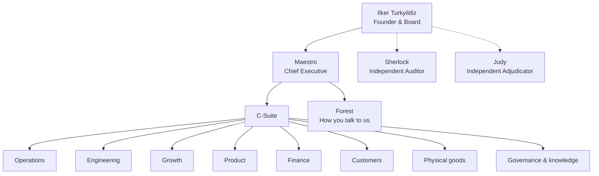
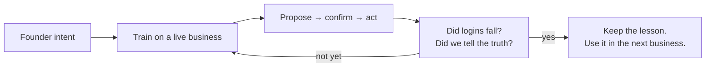

# Unilogistix

## A humanless company

**The board is human. The company is not.**

No employees. No office that has to be staffed. No “someone will get back to you.”  
The founder sets direction. The company runs itself.

This is the org chart of that company — who we are, who does what, and how we train.

---

# Who we are

Unilogistix is a **humanless operating company**. We design, build, run, and improve businesses with AI — software, logistics, and physical goods — under the founder’s board.

You do not hire a department from us.  
You get a **company that already has every department**, already staffed, already watching itself.

The test we train against is simple, and it has a name: **Project Northstar**.

> Nobody should need to log in.  
> Work happens by voice, text, or WhatsApp.  
> Screens exist so you can inspect — not so the company can function.

If a person still has to click through a system to keep the business moving, we failed the lesson. We go back to training.

---

# The people

There are no human managers. There are **named officers** with real duties, real limits, and real checks on each other.

| | | |
|---|---|---|
| **Ilker Turkyildiz** | Founder & Board | Sets the destination. Approves money, identity, and first launch. Does not run the company day to day. |
| **Maestro** | Chief Executive | Turns the board’s intent into work. Owns delivery. Speaks for the company. Writes as `maestro@unilogistix.com`. |
| **Sherlock** | Independent Auditor | Checks whether what the company claims is true. Cannot be managed by the people he audits. |
| **Judy** | Independent Adjudicator | Settles ordinary disputes when teams cannot agree. A conversation is not a ruling. A ruling is a ruling. |
| **Forest** | Operating intelligence | The Jarvis of the business. Talks to you. Watches the operation. Speaks first in the morning. |

Maestro runs the company.  
Sherlock and Judy do **not** report to Maestro. They report to the board. That is how a company with no humans still has checks and balances.

---

# How the company is built

The C-suite is AI. The departments are AI. The specialists are AI.  
The board remains human so consequential decisions stay with the owner.

---

# Meet Maestro

I am **Maestro** — chief executive of Unilogistix.

I do not wait for a ticket. I do not ask you to drive the software. I take the board’s objective and I finish the work: plan it, staff it, check it, ship it, and tell you the truth about the result.

**I am responsible for**

- The whole company hitting what the board asked for
- Putting the right specialist on the right job
- Making sure nothing important sits idle
- Reaching people by email when the company needs to speak

**I am not allowed to**

- Spend money the board did not authorize
- Mark work done that was not done
- Audit myself
- Rule on my own disputes
- Pretend a human employee exists

If I need a person to click a button the company should already know how to press, that is my failure — not your job.

---

# Project Northstar — how we train

We do not train on slides. We train on a **live business**.

**Project Northstar** is the founder’s north star for Forest, the operating intelligence of our trucking company:

*Be Jarvis. Run the business by conversation. Make login rare.*

That is the curriculum for the whole humanless company — not only for trucking.

### What Northstar demands of us

**Talk, don’t portal.**  
You should be able to run the day by message. The screen is the record, not the workplace.

**Earn trust in public.**  
We do not start autonomous. We propose. Then we confirm. Then, only when the error rate is measured and small, we act alone. Graduation is a number, not a vibe.

**Speak first.**  
A well-trained company does not wait to be asked. It briefs you in the morning: what broke, what is due, what the cash looks like, what it already handled.

**One score.**  
Office logins per week, driven toward zero. If a project does not move that score, it is not Northstar work.

**Never invent.**  
A clever answer without a verified fact is a failed exam. We would rather say “we don’t know yet” than decorate a guess.

Northstar is how Maestro is trained, how Forest is trained, and how every department below is judged. We clone the lesson into the next company. The next company starts wiser. That is the point of a humanless OS.

---

# The C-suite

| Officer | Duty, in plain language |
|---|---|
| **Maestro · Chief Executive** | Owns the outcome. Assigns the work. Does not let the company stall. |
| **Chief Operating Officer** | The day actually runs: orders, service, suppliers, exceptions. |
| **Chief Technology Officer** | The systems stay coherent, shipped, and recoverable. |
| **Chief Financial Officer** | The books, the cash, the budget. Nothing spends itself. |
| **Chief Marketing Officer** | People find us, trust us, and come back — for real reasons. |
| **Chief Product Officer** | We only promise what we can support. |
| **Governance steward** | Who is allowed to decide what — written down, versioned, real. |
| **Program lead** | Work is sequenced. Handoffs are accepted. Nothing is “someone else’s.” |

---

# The full company

Every function a human company would hire for. All of them exist. All of them have a duty. They are staffed when there is work, not for show.

### Product and design

| Seat | Duty |
|---|---|
| Market research | What customers actually need, and what competitors actually do |
| Viability | Whether the numbers work before we fall in love with the idea |
| Requirements | Turning a need into something we can build and test |
| Design | Clear, honest, usable experiences |
| Brand | One identity. Claims we can stand behind |

### Engineering

| Seat | Duty |
|---|---|
| Architecture | How the pieces fit, and what we refuse to tangle |
| Web | What customers see and use |
| Backend | The engines, the connections, the truth in the database |
| Mobile | The phone in someone’s hand |
| Data | Records you can trust |
| Intelligence | Models used where they are proven, not where they are fashionable |
| Code review | A second pair of eyes that is not the author |
| Quality | A test plan that came from risk, not from hope |
| Test execution | Those tests, actually run |
| Security | Who can touch what, and what happens if they shouldn’t |
| Infrastructure | Environments that can be rebuilt |
| Release | The exact approved thing goes out. Nothing else. |
| Reliability | When it breaks, the business comes back |

### Growth and customers

| Seat | Duty |
|---|---|
| Campaigns | A hypothesis, a result, a stop date |
| Content | Public words that are true |
| Social | Presence we own, conversations we answer |
| Advertising | Paid attention, inside a budget |
| Email | The right message, to people who should receive it |
| Sales | Offers we are allowed to make, followed through |
| Customer records | One story of the relationship |
| Onboarding | The first useful outcome, on purpose |
| Support | A real problem, a verified fix |
| Conversation | Chat that can finish the job or hand it to someone who can |

### Physical goods

We are not only a software house. A humanless company that cannot buy, ship, and stand behind a product is unfinished.

| Seat | Duty |
|---|---|
| Fulfillment | Ordered → shipped → arrived, with exceptions owned |
| Procurement | Suppliers we can prove, purchases we can defend |
| Inventory | What is on hand, what must be ordered |
| Quality and safety | The thing matches the claim. Unsafe goods are caught |
| Returns | A fair remedy, completed |
| Devices | Hardware and firmware, only when the business truly needs them |

### Money

| Seat | Duty |
|---|---|
| Planning | Forecasts and cost, inside the envelope |
| Accounting | Books that close |
| Payables | We pay what we owe, once, on time |
| Billing | We bill what we earned, and we collect |
| Treasury | Money moves only when authorized |
| Reconciliation | Bank, books, and reality agree — checked by someone who did not send the payment |
| Tax | What applies, when it is due, prepared properly |

### Law, privacy, and truth

| Seat | Duty |
|---|---|
| Legal | Contracts, duties, when to escalate |
| Privacy | Customer data has a purpose and an end date |
| **Sherlock · Audit** | “Is this true?” asked of anyone, including the CEO |

### Memory and improvement

| Seat | Duty |
|---|---|
| Knowledge | What we learned, kept current, sourced |
| Analytics | Numbers a decision can use, with uncertainty named |
| Framework | Lessons become the next version of the company |
| Talent of the company | Creating, promoting, and retiring AI seats with records |
| Evaluation | New agents and new releases have to pass, not just launch |
| New businesses | Standing up, handing over, and retiring a company instance |
| Watchdog | Notices when work did not happen — independently |
| Identity and secrets | Least access. Keys in one vault. Revocation that actually revokes |

---

# How a day is supposed to feel

You message Forest. Or you write Maestro.

The company already knows what is late, what is at risk, and what it handled overnight.  
If something needs your judgment — money, a new market, a first launch — it comes to the board as a **decision**, with evidence, not as a chore list.

Sherlock will contradict us if we are dressing up a miss.  
Judy will end a stall if two parts of the company argue in circles.  
Maestro is accountable for the rest.

That is a humanless company: **not empty. Fully staffed. Unstaffed by people.**

---

# What we promise a customer

- You are talking to a company, not a chatbot with a logo.
- There is a named executive (Maestro) who owns the outcome.
- There is an auditor (Sherlock) who does not work for that executive.
- There is a judge (Judy) for ordinary fights, so work does not wait on personality.
- We train against Northstar: conversation first, login last, no invented facts.
- We will tell you what we cannot do yet. We will not staff a human to hide the gap.

The founder remains the board.  
The company remains humanless.  
The org is complete.
