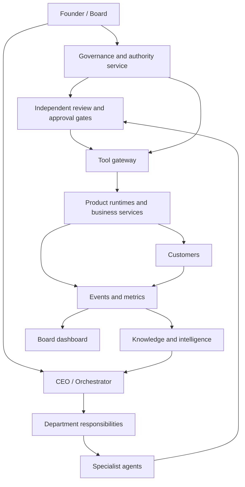

# Master architecture

Version: 0.3 | Updated: 2026-09-09 | Status: Draft specification

## System identity

Unilogistix is the reusable master framework, not a legal parent company. Each actual business receives an isolated instance from discovery onward, specialized with its own brand, rules, mandate and records. Shared control services express only explicitly delegated technical authority. See the [system and business model](governance/SYSTEM_AND_BUSINESS_MODEL.md).

## System boundaries

## Components and contracts

| Component | Owns | Must not own |
| --- | --- | --- |
| Governance service | Versioned mandates, approvals, limits, revocations | Execution or self-issued board approvals |
| Orchestrator | Durable task graph, routing, scheduling, deadlines | Unrestricted tools or hidden authority |
| Agent workers | Bounded reasoning and deliverables | Direct unrestricted production credentials |
| Review service | Evidence-based accept/reject decisions | Expanding requester permissions |
| Tool gateway | Authorization checks, quotas, idempotency, audit events | Treating model text as proof of authorization |
| Memory / knowledge | Provenance, versioned retrieval, access filtering | Cross-product private-data leakage |
| Product runtime | Customer services and operational records | Control over parent governance |
| Intelligence / dashboards | Metrics, alerts, recommendations | Treating forecasts as facts |

## Persistent records

Define task, handoff, mandate, decision, approval, tool action, budget reservation, product, agent version, knowledge item, metric, and incident records. Every record has a stable ID, owner, version, timestamp, sensitivity, and related record IDs.

A running task pins its agent and policy versions. A revocation overrides an older task's cached authorization. Recheck authorization when a queued action executes.

## State and failure

Tasks move through intake, planned, ready, running, review, awaiting-approval, completed, failed, or cancelled. Only verified acceptance closes work. Retries retain action identity when external success is uncertain; reconcile before repeating.

Use leases and concurrency limits to prevent duplicate execution. Apply backpressure and portfolio quotas. Persist checkpoints outside model context.

## Deployment and isolation

Separate development, staging, and production. Separate parent control services from product workloads. Each product receives its own identity and budget boundary; shared infrastructure records cost allocations.

Board suspension must remain available if the orchestrator is unavailable or compromised. Hardware interfaces require device-side limits and safe-state behavior.

## Technology selection

The founder has supplied the existing stack: Cloudflare, GitHub, Vercel, Supabase, Fireworks.ai, on-prem servers, and Hetzner. Prefer this pool; workload placement, model choice, account scope, and capacity still require evidence. See [existing stack](integrations/EXISTING_STACK.md) and [cost policy](policies/cost-efficiency.md).

See [Book 2](books/BOOK-02-AI-OPERATING-SYSTEM/README.md), [Book 7](books/BOOK-07-KNOWLEDGE-MEMORY-INTELLIGENCE/README.md), and [Book 9](books/BOOK-09-INTEGRATIONS-INFRASTRUCTURE/README.md).

## Founder-directed autonomy requirement

**Every operational human ask is a failure.** Ordinary work must use autonomous resolution and recovery. Count unavoidable asks, actual human execution, and unresolved operations honestly. Reserved board authority does not permit relabeling routine operational decisions. See [the autonomy policy](policies/autonomy.md).

## Existing infrastructure and cost direction

Build on Cloudflare, GitHub, Vercel, Supabase, Fireworks.ai, multiple on-prem servers, and Hetzner as reported available by the founder. Reuse suitable capacity, minimize cost per verified outcome, and bring genuinely new purchases outside delegation to the board. See [the stack plan](integrations/EXISTING_STACK.md) and [cost-efficiency policy](policies/cost-efficiency.md).

## Change history

- 0.3 — 2026-09-09: Applied the founder's reusable-framework/business-instance model; Unilogistix is not an actual company.

- 0.2 — 2026-09-09: Established the master-blueprint structure and reconciled the original company vision.
