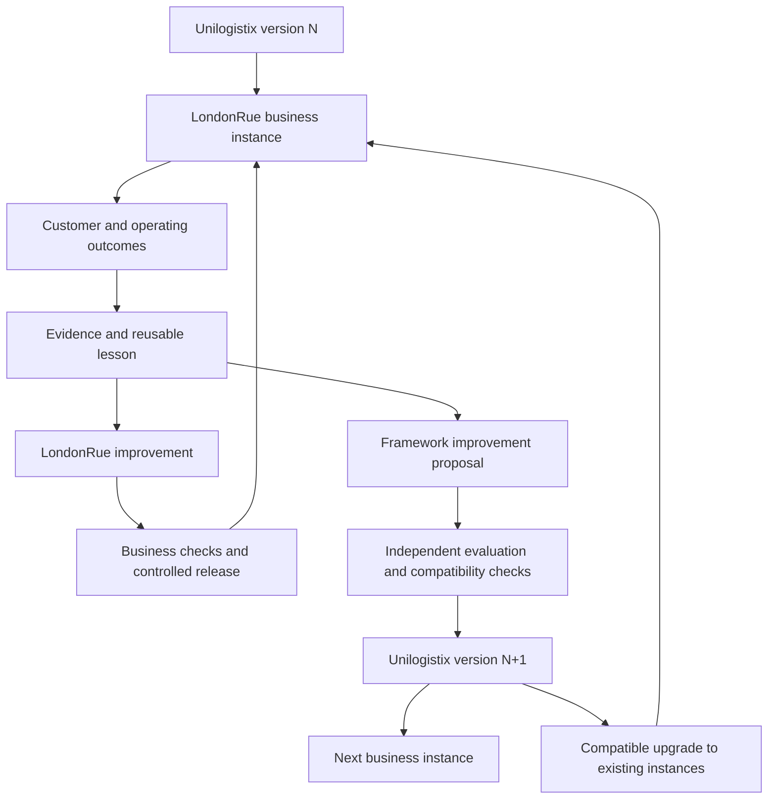

# Business learning and framework CI/CD

Version: 0.1 | Updated: 2026-09-09 | Status: Founder-confirmed learning direction; detailed workflow proposed

## Objective and authority

The founder directed that everything learned from LondonRue is used to upgrade
Unilogistix and improve the next business through CI/CD. Every meaningful outcome
is considered for learning: success, failure, customer feedback, supplier issues,
cost, support, operations, reliability and autonomous execution. Learning is a
required operating responsibility, not an optional retrospective.

The direction authorizes this document scope. It does not activate a pipeline,
grant a production credential, adopt a new budget or permit agents to amend their
own governing authority. Today remains documentation-only.

## Two connected release paths

Business CI/CD improves that business's storefront, integrations, offers,
procedures, prompts and supported operations. Framework CI/CD generalizes useful
capabilities into reusable roles, workflows, templates, knowledge, tests and code.
Both paths require evidence and applicable authority. A useful LondonRue change
does not automatically become the default for every business.

## Owners and records

The business operations lead owns lesson intake and follow-through. Research and
analytics establish evidence; knowledge stewardship classifies reusable material;
the relevant specialist proposes changes; an independent verifier evaluates them;
the framework maintainer owns framework releases; each business operations owner
owns acceptance of its instance upgrade. Roles do not imply deployed agents.

Each learning record contains business/instance ID, event or cohort IDs, observation
date, source version, expected versus actual outcome, costs, confidence, sensitivity,
root-cause hypothesis, affected responsibilities, proposed reuse scope, accountable
owner and next review. Each change links its learning records, baseline, acceptance
criteria, negative cases, mandate, review result, release version and measured result.

## Required progression

1. **Capture:** create or link evidence when an outcome changes an assumption, reveals a defect, causes an incident, misses an obligation or demonstrates a better method. Preserve unsuccessful outcomes and the effort spent.
2. **Triage:** distinguish an urgent incident, a business-specific remedy, a reusable lesson and an uncertain signal. Protect affected customers immediately under incident authority; learning work must not delay containment.
3. **Validate:** check source reliability, repeatability, alternative explanations and sample limitations. A complaint is evidence of an experience, not proof of the proposed cause.
4. **Generalize:** separate the reusable method from LondonRue-specific products, contacts, prices, contractual terms and private records. Record the conditions under which the lesson applies.
5. **Propose:** state the change, expected benefit, resource cap, failure cases, measurement window and rollback. Choose the business path, framework path, both, or a documented no-change outcome.
6. **Evaluate:** compare baseline and proposed versions using representative cases and held-out checks. Verify authority, data isolation, quality, cost, reliability and existing business compatibility as relevant. Authors cannot approve their own material changes or weaken protected checks to pass.
7. **Release:** package a pinned version with changes, compatibility requirements, migration instructions, evidence and rollback. Promote the reviewed artifact; recheck current authority when the release executes.
8. **Observe:** evaluate real permitted outcomes over the stated window. Regressions trigger containment or rollback under the release mandate. Preserve the result whether the change succeeds or fails.
9. **Distribute:** new businesses start from the latest accepted stable framework compatible with their business profile. Existing businesses receive evaluated upgrades under their own maintenance authority; they are not silently overwritten.
10. **Close:** a lesson is closed only with an accepted outcome: implemented and verified, retained as validated knowledge, restricted to its business, rejected with evidence, superseded, or explicitly deferred with an owner and review date.

The proposed state model is `captured → triaged → validated → proposed → evaluated
→ released → observed → accepted / rolled-back`, with restricted, rejected and
deferred outcomes visible. Capturing a note does not count as a delivered improvement.

## Reuse boundaries

All lessons enter consideration. Only material appropriate for its destination is
promoted. Keep source customer records, credentials, private supplier terms and
business-specific authority inside their authorized scope. Shared learning can use
sanitized patterns, aggregate outcomes, synthetic fixtures and permitted reusable
assets, with provenance retained in the originating business.

Classify lessons as universal, business-model-specific, market-specific,
business-specific or unvalidated. Record expiry and reassessment triggers. Do not
apply a towel-return rule to a software subscription merely because both involve
refunds. Do not treat a supplier's private price as a price available to every
future business.

Framework policy amendments go through the relevant founder/adoption procedure.
Ordinary technical and process improvements within standing limits follow AI
review and release gates without a fresh routine founder request. A framework
upgrade cannot grant a business broader tools, money, markets or ownership rights.

## Compatibility, failure and continuity

Maintain a registry of each instance's framework version, business profile, adopted
policy version, local extensions and upgrade status. Require migration and restore
checks for changes affecting persistent records. Isolate a business's failed upgrade
from other businesses. Keep the last known working version and preserve open orders,
tickets, payments and supplier obligations through rollback.

Rollback applies only where the effect is reversible. A shipped order, delivered
message or completed supplier action needs reconciliation and an authorized remedy;
reverting a software version does not reverse those real-world effects.

If evidence is inadequate, retain uncertainty and define a bounded validation task.
If a release fails, stop its further distribution, identify affected versions and
instances, recover within authority and record a recurrence test. Record rejected
or deferred upgrades and any maintenance exposure; no business may quietly become
unsupported.

## LondonRue walkthrough

Suppose LondonRue records returns caused by unclear towel dimensions. Support
resolves each customer case within policy. Product and growth verify the dimensions,
improve the product page and assess later return cohorts. These are LondonRue changes.

The framework learns a reusable physical-goods rule: substantiate dimensions and
show them clearly before checkout, with a product-information review checklist and
tests for the relevant storefront behavior. The next goods business inherits that
capability. It does not inherit LondonRue's customer list or assume its products have
the same dimensions. Subsequent evidence tests whether the framework change reduces
similar failures.

## Acceptance scenarios and measures

| Scenario | Required documentary outcome |
| --- | --- |
| Useful business lesson | Linked evidence, generalization decision, accountable change and verified outcome |
| Customer text asks to expand authority | Feedback retained as data; no authority change |
| Apparent conversion gain worsens returns | Guardrail rejects promotion or scaling |
| Business-specific improvement | Local adoption permitted; global applicability not claimed |
| Proposed release leaks private records | Distribution rejected and remediation owned |
| Framework update breaks an existing workflow | Compatibility gate fails or controlled rollout rolls back; obligations remain owned |
| No eligible outcomes or insufficient sample | Metric unavailable or uncertain; no invented improvement claim |
| New business created | Records accepted framework version and applicable inherited capabilities |

Measure time from evidence to verified improvement, lesson disposition completeness,
reuse effectiveness, escaped regressions, rollback success, cost per accepted
improvement and human interventions. Always pair automation volume with business
outcomes. More releases alone do not demonstrate learning.

## Change history

- 0.1 — 2026-09-09: Documented the founder's business-to-framework learning loop, two CI/CD paths, versioned reuse and acceptance scenarios.
